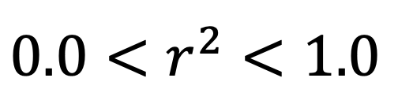

# Linear Regression

Linear Regression | Example code and own notes while taking the course "Intro to Machine Learning" on Udacity.

## Performance metrics (In sklearn)

R-squared (sum of the errors) = Performance of your regreession: `reg.score()`

Slope: `reg.coef_`

Intercept: `reg.intercept_`

## Errors

## Minimizing the Sum of Squared Errors (SSE)

The **best regression** is the one that minimizes the sum of squared errors.

- **actual:** training points

- **predicted:** predictions from regression (`y = mx + b`)

There can be multiple lines that minimizes `∑|error|`, but only one line will minimize `∑error²`!

SSE is an evaluation metric, however, if you have more data you might get larger SSe, so this does not mean that you have worse fit. right?

## Several algorithms
- Ordinary last squares (OLS): _Used in sklearn linear regression_
- Gradient descent

## r² ("R-squared") of a regression
How much of my change in the output (y) is explained by the change in my input (x)?

- **0.0:** Line isn't doing a good job of capturing trend data
- **1.0:** Line does a good job of describing relationship between input(x) and output(y)

R-squared is independent of the number of training points.

# Comparing Classification & Regression

|Property|Supervised Classification|Regression|
|---|---|---|
|Output Type|Discrete(class labels)|Continuous (number)|
|What are you trying to find?|Decision boundry|Best fit line|
|Evaluation|Accuracy|Sum of squared error -or- r²|