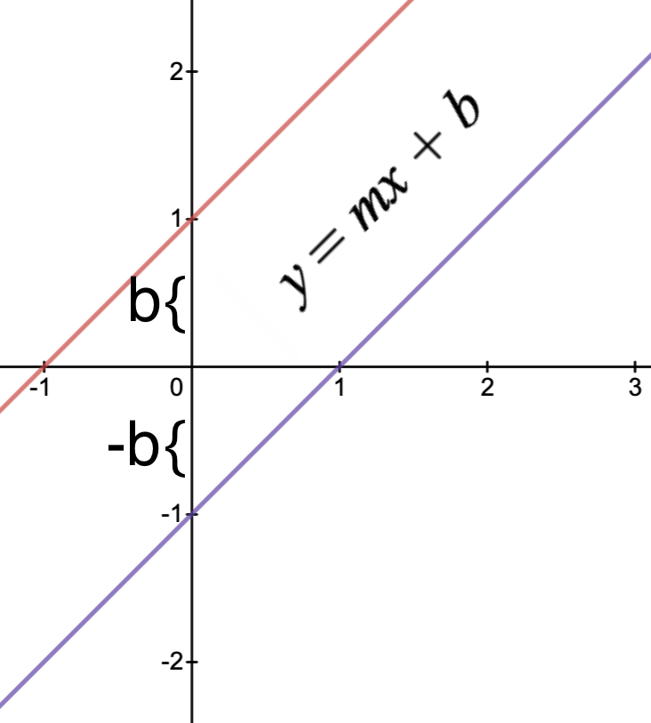
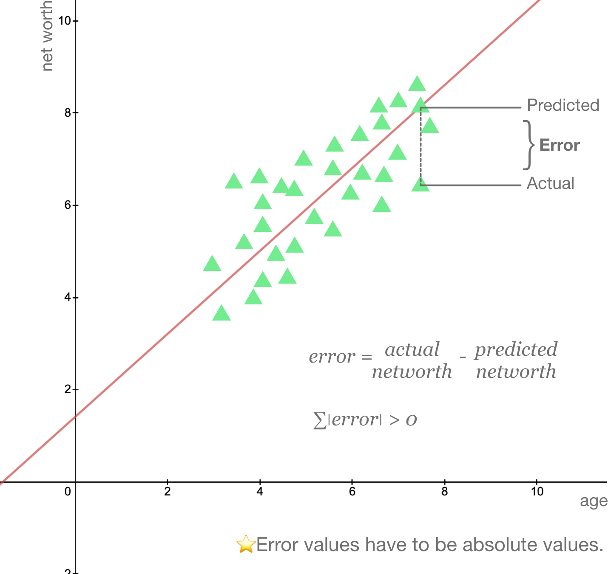
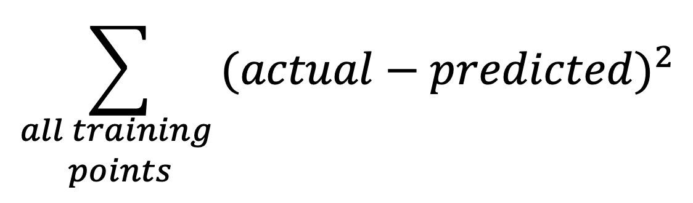
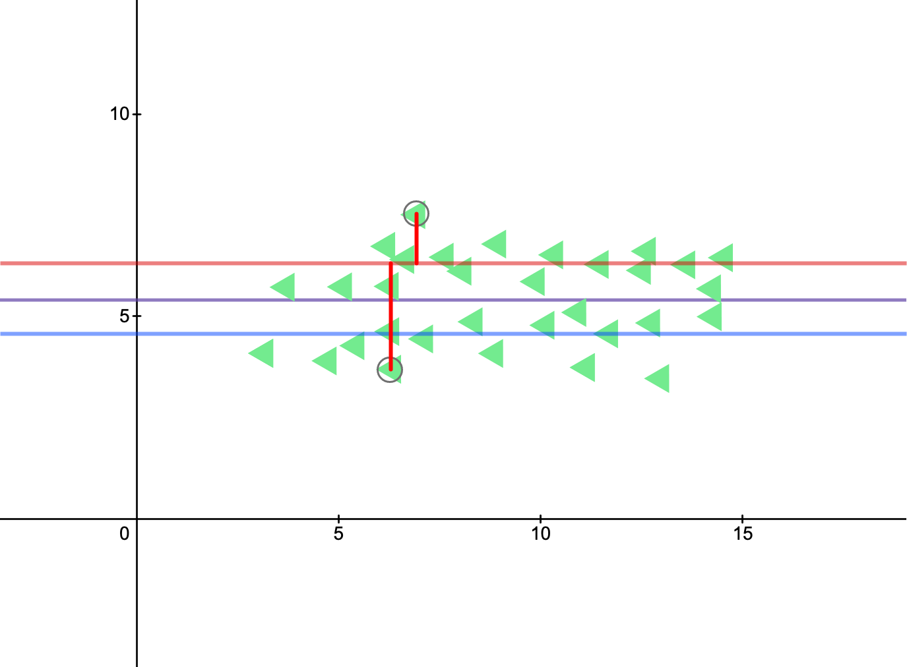

# Linear Regression

Linear Regression | Example code and own notes while taking the course "Intro to Machine Learning" on Udacity.

## Performance metrics:

R-squared (sum of the errors) = Performance of your regreession: `reg.score()`

Slope: `reg.coef_`

Intercept: `reg.intercept_`

## Errors

## Minimizing the Sum of Squared Errors (SSE)

The **best regression** is the one that minimizes the sum of squared errors.

- **actual:** training points

- **predicted:** predictions from regression (`y = mx + b`)

There can be multiple lines that minimizes `∑|error|`, but only one line will minimize `∑error²`!

> SSE is an evaluation metric, however, if you have more data you might get larger SSe, so this does not mean that you have worse fit. right?

## Several algorithms
- Ordinary last squares (OLS): _Used in sklearn linear regression_
- Gradient descent
